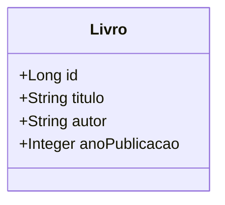

# Gerenciamento de livros por linha de comando
O sistema permite o cadastro e gerenciamento de livros em um banco de dados PostgreSQL por meio de uma interface em linha de comando.
Com ele, é possível adicionar novos livros informando título, autor e ano de publicação, além de buscar livros pelo ID ou parte do título.
O sistema também oferece funcionalidades para listar todos os livros cadastrados, atualizar informações de um livro sem a necessidade de preencher todos os campos novamente e excluir registros.
Todas as operações são realizadas garantindo a integridade dos dados, e o menu oferece uma navegação intuitiva para facilitar a interação do usuário.

## Diagrama de classes

## Instalação
Após clonar e importar o repositório:
1. Configure o banco de dados:
  - Para facilitar, use o banco de dados PostgreSQL e crie um banco de dados chamado "livros" sem tabelas.
  - Caso queira usar outro, terá que alterar as migrations, queries e a [conexão](https://github.com/wastecoder/spring-cli-livro/blob/main/src/main/java/com/cli/livro/config/ConnectionConfig.java).
  - Além disso, terá que colocar a dependência do banco escolhido no pom.xml.
2. Execute o arquivo __LivroApplication__ e use o menu.
